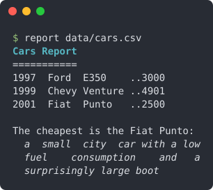

<div align="center">

# StringiFor
#### Strings Fortran Manipulator, with steroids

[](https://github.com/szaghi/StringiFor/tags)
[](https://github.com/szaghi/StringiFor/issues)
[](https://github.com/szaghi/StringiFor/actions/workflows/ci.yml)
[](https://github.com/szaghi/StringiFor/actions/workflows/ci.yml)
[](#copyrights)

> A string type for modern Fortran with the methods you miss from Python: split, join, replace, strip, slice, justify,
> cast to and from numbers, read and write files.
> One type, one module, pure Fortran 2008.


<sub>A real session of the short program of the <a href="#quick-start">quick start</a> below: every answer is one method of the <code>string</code> type.</sub>

<div>
<table>
<tr>
<td width="50%"><b>🔤 A real string type</b><br><sub>One type holding a string of any length: arrays whose elements have different lengths, no <code>trim()</code> everywhere, no silent truncation. <a href="https://szaghi.github.io/StringiFor/manual/tutorial/01-first-string">A first string</a></sub></td>
<td width="50%"><b>🔗 A drop-in for <code>character</code></b><br><sub>Assignment, <code>//</code>, the comparison operators and the intrinsics (<code>trim</code>, <code>index</code>, <code>len_trim</code>, <code>repeat</code>, ...) accept a string wherever a character goes. <a href="https://szaghi.github.io/StringiFor/guide/basic-io">Strings and I/O</a></sub></td>
</tr>
<tr>
<td width="50%"><b>✂️ Split, join, slice</b><br><sub><code>split</code> and <code>partition</code> into tokens (the empty CSV fields kept, if you want), <code>join</code> arrays back, <code>slice</code> with a stride, reverse characters or words, <code>replace</code>, <code>strip</code>, <code>compact</code> whitespace, <code>squeeze</code> repeats, <code>transliterate</code> sets of characters. <a href="https://szaghi.github.io/StringiFor/guide/string-manipulation">String manipulation</a></sub></td>
<td width="50%"><b>🔠 Case and layout</b><br><sub><code>upper</code>, <code>lower</code>, <code>capitalize</code>, camelCase, snake_case, Start Case; <code>is_alpha</code>, <code>is_space</code>, <code>is_punct</code>...; pad, <code>center</code> or justify to a width, expand tabs, wrap a paragraph in fully justified lines. <a href="https://szaghi.github.io/StringiFor/guide/string-manipulation#case-conversion">Case conversion</a> · <a href="https://szaghi.github.io/StringiFor/guide/string-manipulation#padding-and-layout">Layout</a></sub></td>
</tr>
<tr>
<td width="50%"><b>🔢 Numbers in, numbers out</b><br><sub>Assign any integer or real kind to a string, cast back with <code>to_number</code>, or with <code>read_number</code> and an error status; ask <code>is_number</code>, <code>is_integer</code>, <code>is_real</code>; hexadecimal representation with <code>hex</code>. <a href="https://szaghi.github.io/StringiFor/guide/numbers">Numbers</a></sub></td>
<td width="50%"><b>📁 Files and paths</b><br><sub>Read a file into an array of lines or one string, write it back, read line by line; <code>basedir</code>, <code>basename</code>, <code>extension</code>, <code>glob</code>, wildcard <code>match</code>, temporary names. <a href="https://szaghi.github.io/StringiFor/guide/advanced">Files and paths</a></sub></td>
</tr>
<tr>
<td width="50%"><b>⚖️ Comparisons that know more</b><br><sub>Longest common prefix of many strings, version numbers compared field by field, <code>start_with</code>, <code>end_with</code>, <code>count</code>. <a href="https://szaghi.github.io/StringiFor/guide/string-manipulation#comparing">Comparing</a></sub></td>
<td width="50%"><b>🎨 Encoding and colours</b><br><sub>Base64 <code>encode</code> and <code>decode</code>, <code>escape</code> and <code>unescape</code>, ANSI colours and styles for the terminal. <a href="https://szaghi.github.io/StringiFor/guide/advanced#encoding">Encoding</a> · <a href="https://szaghi.github.io/StringiFor/guide/advanced#colours-for-the-terminal">Colours</a></sub></td>
</tr>
<tr>
<td width="50%"><b>⚡ Elemental by design</b><br><sub>Almost every method is <code>pure</code> or <code>elemental</code>: apply it to a whole array of strings in one statement, use it in pure procedures. <a href="https://szaghi.github.io/StringiFor/manual/cookbook#a-method-on-every-element-of-an-array">Arrays of strings</a></sub></td>
<td width="50%"><b>🧪 Tested by its own documentation</b><br><sub>Every method carries doctests in its source; every example of the documentation is a program compiled and run to produce the output shown. <a href="https://szaghi.github.io/StringiFor/manual/">The examples</a></sub></td>
</tr>
<tr>
<td width="50%"><b>🛠️ Standard Fortran, any build</b><br><sub>Fortran 2008, built with FoBiS, fpm, CMake or Make. Three small dependencies, fetched for you. <a href="https://szaghi.github.io/StringiFor/guide/installation">Installation</a></sub></td>
<td width="50%"><b>🔓 Multi-licensed</b><br><sub>GPL v3 for FOSS projects; BSD 2-Clause, BSD 3-Clause or MIT for closed source and commercial ones: pick the license that fits. <a href="#copyrights">Copyrights</a></sub></td>
</tr>
</table>
</div>

**[Full documentation](https://szaghi.github.io/StringiFor/)** · [Tutorial](https://szaghi.github.io/StringiFor/manual/tutorial/01-first-string) · [Cookbook](https://szaghi.github.io/StringiFor/manual/cookbook) · [API reference](https://szaghi.github.io/StringiFor/api/)

</div>

## Quick start

One type, `string`, and its methods. This is the whole program behind the session above: a `select case` on the
command, one method for each answer.

```fortran
program sf
!< Quick start: a tiny command line tool, one StringiFor method for each command.
use stringifor
implicit none
type(string)              :: command, text, other
type(string), allocatable :: lines(:)
integer                   :: l

command = argument(1)
text = argument(2)
select case(command%chars())
case('upper')
  call show(text%upper()//'')
case('snake')
  call show(text%snakecase()//'')
case('reverse')
  call show(text%reverse_words()//'')
case('justify')
  call text%justify(lines=lines, width=34)
  do l = 1, size(lines)
    call show('|'//lines(l)//'|')
  enddo
case('newer')
  other = argument(3)
  call show(merge(text, other, text%compare_version(other) > 0)//'')
case('hex')
  call show('0x'//text%hex())
case('number')
  if (text%is_integer()) then
    call show('an integer')
  elseif (text%is_real()) then
    call show('a real')
  else
    call show('not a number')
  endif
endselect

contains
  function argument(n) result(arg)
  !< The n-th command line argument, as a string.
  integer, intent(in)       :: n
  type(string)              :: arg
  character(:), allocatable :: buffer
  integer                   :: length

  call get_command_argument(n, length=length)
  allocate(character(length) :: buffer)
  call get_command_argument(n, value=buffer)
  arg = buffer
  endfunction argument

  subroutine show(answer)
  !< Print an answer, in colour.
  character(*), intent(in) :: answer
  type(string)             :: coloured

  coloured = answer
  print '(A)', coloured%colorize(color_fg='cyan', style='bold_on')
  endsubroutine show
endprogram sf
```

```console
$ sf justify "StringiFor gives Fortran a string type with the methods you miss from Python."
|StringiFor  gives Fortran a string|
|type  with  the  methods  you miss|
|from Python.                      |
```

## Grows with your program

The same methods take you from a line of text to a report read from a file, cleaned, computed and laid out. This is
the output of the program built step by step in the
[tutorial](https://szaghi.github.io/StringiFor/manual/tutorial/01-first-string):

<p align="center"></p>

New to StringiFor? The [tutorial](https://szaghi.github.io/StringiFor/manual/tutorial/01-first-string) builds a complete
program step by step; the [cookbook](https://szaghi.github.io/StringiFor/manual/cookbook) has short recipes. Every
example is a compiled, runnable program in [`docs/examples/src`](docs/examples/src), shown with its real output in the
[documentation](https://szaghi.github.io/StringiFor/).

## Install

### FoBiS

**Standalone** — clone, fetch dependencies, and build:

```bash
git clone https://github.com/szaghi/StringiFor && cd StringiFor
fobis fetch                                    # fetch PENF, FACE, BeFoR64
fobis build --mode stringifor-static-gnu        # build static library
```

Or install directly in one command:

```bash
fobis install szaghi/StringiFor --mode stringifor-static-gnu
fobis install szaghi/StringiFor --mode stringifor-static-gnu --prefix /path/to/prefix
```

**As a project dependency** — declare StringiFor in your `fobos` and run `fetch`:

```ini
[dependencies]
deps_dir = src/third_party
StringiFor   = https://github.com/szaghi/StringiFor
```

```bash
fobis fetch           # fetch and build
fobis fetch --update  # re-fetch and rebuild
```

### fpm

Add to your `fpm.toml`:

```toml
[dependencies]
StringiFor = { git = "https://github.com/szaghi/StringiFor" }
```

```bash
fpm build
```

### CMake

```bash
cmake -B build && cmake --build build
```

### Makefile

```bash
make              # static library
make TESTS=yes    # build the tests suite
```

A Fortran 2008 compiler is required (see [Installation](https://szaghi.github.io/StringiFor/guide/installation)).

## Authors

- Stefano Zaghi — [@szaghi](https://github.com/szaghi)

Contributions are welcome — see the [Contributing](https://szaghi.github.io/StringiFor/guide/contributing) page.

## Copyrights

This project is distributed under a multi-licensing system:

- **FOSS projects**: [GPL v3](http://www.gnu.org/licenses/gpl-3.0.html)
- **Closed source / commercial**: [BSD 2-Clause](http://opensource.org/licenses/BSD-2-Clause), [BSD 3-Clause](http://opensource.org/licenses/BSD-3-Clause), or [MIT](http://opensource.org/licenses/MIT)

> Anyone interested in using, developing, or contributing to this project is welcome — pick the license that best fits your needs.
