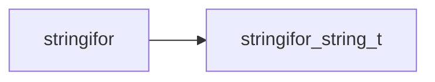
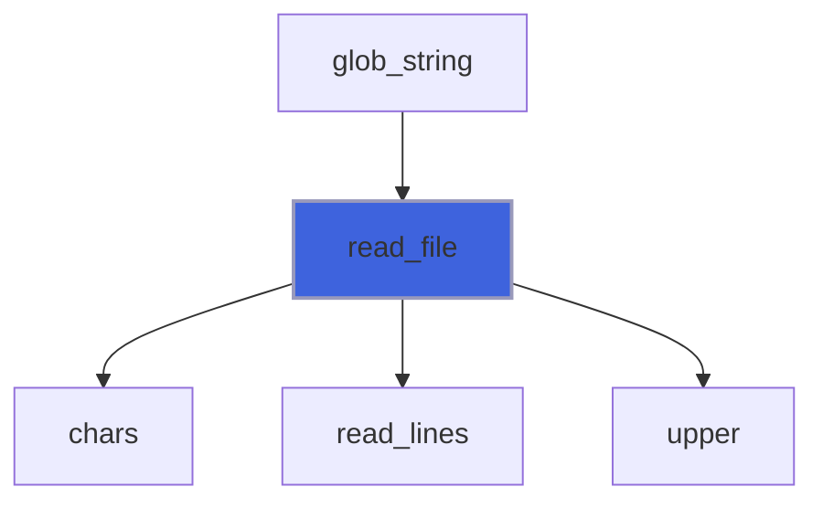
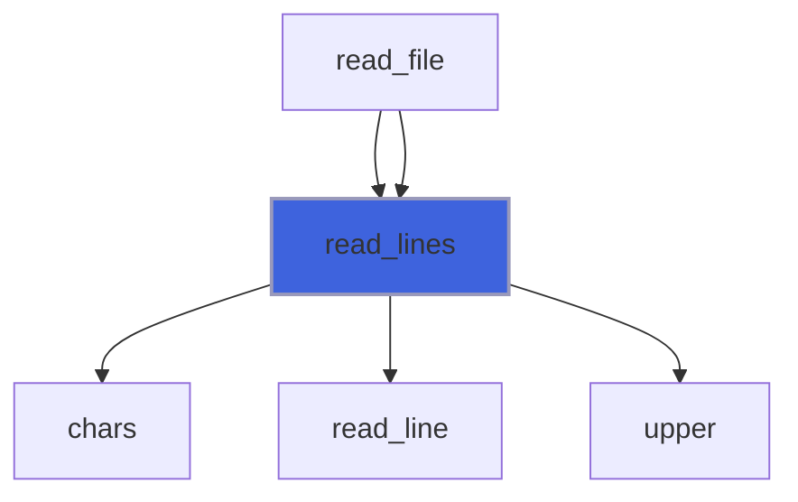
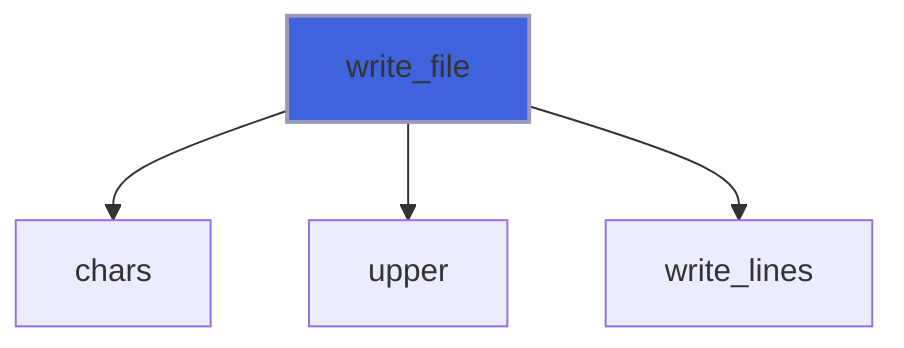
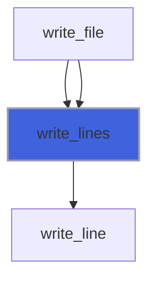

# stringifor

> StringiFor, Strings Fortran Manipulator with steroids.

**Source**: `src/lib/stringifor.F90`

**Dependencies**



## Contents

- [read_file](#read-file)
- [read_lines](#read-lines)
- [write_file](#write-file)
- [write_lines](#write-lines)

## Subroutines

### read_file

Read a file as a single string stream.

 The lines are returned as an array of strings that are read until the eof is reached.
 The line is read as an ascii stream read until the eor is reached.

 @note For unformatted read only `access='stream'` is supported with new_line as line terminator.

```fortran
 type(string)              :: astring
 type(string), allocatable :: strings(:)
 type(string)              :: line(3)
 integer                   :: iostat
 character(len=99)         :: iomsg
 integer                   :: scratch
 integer                   :: l
 logical                   :: test_passed(8)
 line(1) = ' Hello World!   '
 line(2) = 'How are you?  '
 line(3) = '   All say: "Fine thanks"'
 open(newunit=scratch, file='read_file_test.tmp')
 write(scratch, "(A)") line(1)%chars()
 write(scratch, "(A)") line(2)%chars()
 write(scratch, "(A)") line(3)%chars()
 close(scratch)
 call read_file(file='read_file_test.tmp', lines=strings, iostat=iostat, iomsg=iomsg)
 test_passed(1) = (size(strings, dim=1)==size(line, dim=1))
 do l=1, size(strings, dim=1)
   test_passed(l+1) = (strings(l)==line(l))
 enddo
 open(newunit=scratch, file='read_file_test.tmp', form='UNFORMATTED', access='STREAM')
 write(scratch) line(1)%chars()//new_line('a')
 write(scratch) line(2)%chars()//new_line('a')
 write(scratch) line(3)%chars()//new_line('a')
 close(scratch)
 call read_file(file='read_file_test.tmp', lines=strings, form='unformatted', iostat=iostat, iomsg=iomsg)
 test_passed(5) = (size(strings, dim=1)==size(line, dim=1))
 do l=1, size(strings, dim=1)
   test_passed(l+5) = (strings(l)==line(l))
 enddo
 open(newunit=scratch, file='read_file_test.tmp', form='UNFORMATTED', access='STREAM')
 close(scratch, status='DELETE')
 print '(L1)', all(test_passed)
```

```fortran
subroutine read_file(file, lines, form, iostat, iomsg)
```

**Arguments**

| Name | Type | Intent | Attributes | Description |
|------|------|--------|------------|-------------|
| `file` | character(len=*) | in |  | File name. |
| `lines` | type([string](/api/src/lib/stringifor_string_t#string)) | out | allocatable | The lines. |
| `form` | character(len=*) | in | optional | Format of unit. |
| `iostat` | integer | out | optional | IO status code. |
| `iomsg` | character(len=*) | inout | optional | IO status message. |

**Call graph**



### read_lines

Read lines (records) from a connected-formatted unit.

 @note The connected unit is rewinded. At a successful exit current record is at eof, at the beginning otherwise.

 The lines are returned as an array of strings that are read until the eof is reached.
 The line is read as an ascii stream read until the eor is reached.

 @note For unformatted read only `access='stream'` is supported with new_line as line terminator.

 @note There is no doctests, this being tested by means of [read_file](/api/src/lib/stringifor#read-file) doctests.

```fortran
subroutine read_lines(unit, lines, form, iostat, iomsg)
```

**Arguments**

| Name | Type | Intent | Attributes | Description |
|------|------|--------|------------|-------------|
| `unit` | integer | in |  | Logical unit. |
| `lines` | type([string](/api/src/lib/stringifor_string_t#string)) | out | allocatable | The lines. |
| `form` | character(len=*) | in | optional | Format of unit. |
| `iostat` | integer | out | optional | IO status code. |
| `iomsg` | character(len=*) | inout | optional | IO status message. |

**Call graph**



### write_file

Write a single string stream into file.

 @note For unformatted read only `access='stream'` is supported with new_line as line terminator.

```fortran
 type(string)              :: astring
 type(string)              :: anotherstring
 type(string), allocatable :: strings(:)
 type(string)              :: line(3)
 integer                   :: iostat
 character(len=99)         :: iomsg
 integer                   :: scratch
 integer                   :: l
 logical                   :: test_passed(8)
 line(1) = ' Hello World!   '
 line(2) = 'How are you?  '
 line(3) = '   All say: "Fine thanks"'
 anotherstring = anotherstring%join(array=line, sep=new_line('a'))
 call write_file(file='write_file_test.tmp', lines=line, iostat=iostat, iomsg=iomsg)
 call astring%read_file(file='write_file_test.tmp', iostat=iostat, iomsg=iomsg)
 call astring%split(tokens=strings, sep=new_line('a'))
 test_passed(1) = (size(strings, dim=1)==size(line, dim=1))
 do l=1, size(strings, dim=1)
   test_passed(l+1) = (strings(l)==line(l))
 enddo
 call write_file(file='write_file_test.tmp', lines=line, form='unformatted', iostat=iostat, iomsg=iomsg)
 call astring%read_file(file='write_file_test.tmp', form='unformatted', iostat=iostat, iomsg=iomsg)
 call astring%split(tokens=strings, sep=new_line('a'))
 test_passed(5) = (size(strings, dim=1)==size(line, dim=1))
 do l=1, size(strings, dim=1)
   test_passed(l+5) = (strings(l)==line(l))
 enddo
 open(newunit=scratch, file='write_file_test.tmp')
 close(scratch, status='DELETE')
 print '(L1)', all(test_passed)
```

```fortran
subroutine write_file(file, lines, form, iostat, iomsg)
```

**Arguments**

| Name | Type | Intent | Attributes | Description |
|------|------|--------|------------|-------------|
| `file` | character(len=*) | in |  | File name. |
| `lines` | type([string](/api/src/lib/stringifor_string_t#string)) | in |  | The lines. |
| `form` | character(len=*) | in | optional | Format of unit. |
| `iostat` | integer | out | optional | IO status code. |
| `iomsg` | character(len=*) | inout | optional | IO status message. |

**Call graph**



### write_lines

Write lines (records) to a connected-formatted unit.

 @note There is no doctests, this being tested by means of [write_file](/api/src/lib/stringifor#write-file) doctests.

```fortran
subroutine write_lines(unit, lines, form, iostat, iomsg)
```

**Arguments**

| Name | Type | Intent | Attributes | Description |
|------|------|--------|------------|-------------|
| `unit` | integer | in |  | Logical unit. |
| `lines` | type([string](/api/src/lib/stringifor_string_t#string)) | in |  | The lines. |
| `form` | character(len=*) | in | optional | Format of unit. |
| `iostat` | integer | out | optional | IO status code. |
| `iomsg` | character(len=*) | inout | optional | IO status message. |

**Call graph**


