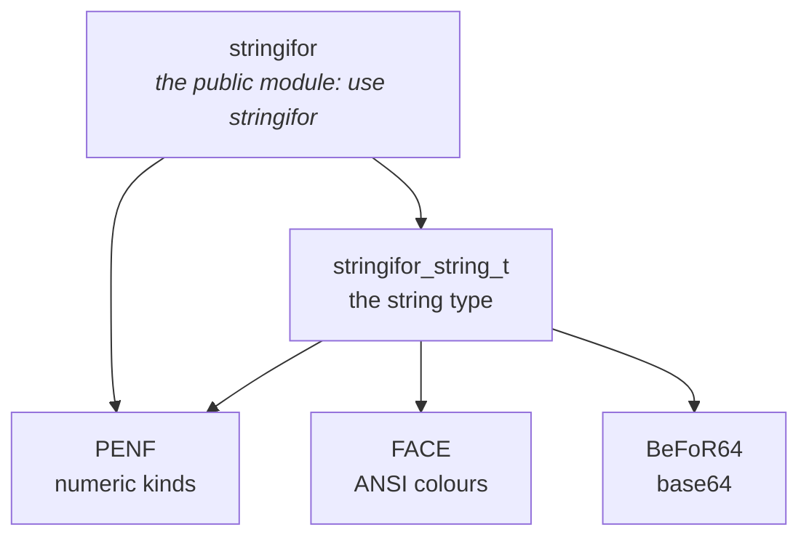

# Features

## One type, one module

Everything is in the `string` type, exported by the `stringifor` module together with the numeric kinds and a few
procedures:

```fortran
use stringifor
type(string) :: s

s = 'Hello World'            ! assign
print '(A)', s%upper()//''   ! call a method, get a character with //
```

## Feature map

| Area | Features | Where |
|---|---|---|
| **The type** | a string of any length; arrays with elements of different lengths; assignment from characters, strings and numbers; `//` (a character) and `.cat.` (a string); `==`, `/=`, `<`, `<=`, `>=`, `>`; defined I/O | [Strings and I/O](./basic-io) |
| **Intrinsics** | `adjustl`, `adjustr`, `count`, `index`, `len_trim`, `repeat`, `scan`, `trim`, `verify` accept a string | [Strings and I/O](./basic-io#the-fortran-intrinsics) |
| **Case** | `upper`, `lower`, `swapcase`, `capitalize`, `camelcase`, `snakecase`, `startcase`; `is_upper`, `is_lower` | [String Manipulation](./string-manipulation#case-conversion) |
| **Classes** | `is_alpha`, `is_alnum`, `is_digit`, `is_xdigit`, `is_punct`, `is_space` | [String Manipulation](./string-manipulation#character-classes) |
| **Cleaning** | `strip` (blanks or a set of characters), `replace`, `unique`, `insert`, `escape`, `unescape`, `lstrip`, `rstrip`, `compact`, `squeeze`, `expand_tabs`, `transliterate`, `quote`, `unquote` | [String Manipulation](./string-manipulation#cleaning-and-replacing) |
| **Tokens** | `split` (empty fields optionally kept), `split_chunked`, `partition`, `join`, `strjoin` (1D and 2D arrays) | [String Manipulation](./string-manipulation#splitting-and-joining) |
| **Parts** | `slice` with a stride, `reverse`, `reverse_words`, `start_with`, `end_with`, `count`, `index`, `scan`, `verify`, `search` between tags | [String Manipulation](./string-manipulation#slicing-and-reversing) |
| **Layout** | `fill`, `center`, `ljust`, `rjust`, `justify`, `len_last_word` | [String Manipulation](./string-manipulation#padding-and-layout) |
| **Comparing** | `common_prefix`, `compare_version` | [String Manipulation](./string-manipulation#comparing) |
| **Numbers** | assignment from any integer and real kind; `to_number`, `read_number` with an error status; `is_number`, `is_integer`, `is_real`, `is_digit`; `hex` | [Numbers](./numbers) |
| **Files** | `read_file`, `read_lines`, `read_line`, `write_file`, `write_lines`, `write_line`, formatted or unformatted stream | [Files and Paths](./advanced) |
| **Paths** | `basedir`, `basename`, `extension`, `glob`, `match` of wildcard patterns, `tempname` | [Files and Paths](./advanced#paths) |
| **Encoding and colours** | base64 `encode` and `decode`; ANSI `colorize` | [Files and Paths](./advanced#encoding) |

The [methods summary](./api-reference) lists every method with its arguments.

## Design goals

| Goal | How |
|---|---|
| **Interchangeable with `character`** | overloaded assignment, `//`, comparisons and intrinsics: a string goes wherever a character does |
| **Low memory consumption** | one allocatable character is the only component: each element of an array is as long as its content |
| **Safe** | almost every method is `elemental` or `pure`; the methods return new values and leave the string unchanged |
| **Tested** | every method carries doctests in its source; every example of these pages is compiled and run |

## Module architecture



Use only the `stringifor` module: it exports the type, the kinds (`I1P`, `I2P`, `I4P`, `I8P`, `R4P`, `R8P`, `R16P`), the
character kind `CK`, the overloaded intrinsics, and the procedures `read_file`, `read_lines`, `write_file`,
`write_lines`, `glob` and `strjoin`.

## Compiler support

| Compiler | Minimum version | Status |
|---|---|---|
| GNU gfortran | ≥ 9.2.0 | Full support |
| Intel `ifort` / `ifx` | ≥ 19.0.4 | Full support |
| NVIDIA `nvfortran` | — | Builds with the `_NVF` macro defined, which disables the `I2P` kind; not regularly tested |
| IBM XL | — | Not tested |
| NAG | — | Not tested |

Any feature request is welcome: open an issue on [GitHub](https://github.com/szaghi/StringiFor/issues).
