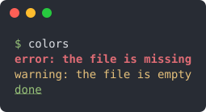

# Cookbook

Short answers to "how do I ...?". Each recipe is a complete program with its real output; the [reference](/guide/features#feature-map) has the details.

[[toc]]

## Print a string

<<< @/examples/snippets/print_string.f90

<<< @/examples/output/print_string.ansi{ansi}

`//''` is the idiom used in all these pages: it works wherever a `character` is expected.

## Assign, concatenate, compare

<<< @/examples/snippets/operators.f90

<<< @/examples/output/operators.ansi{ansi}

`//` gives a `character`, `.cat.` a `string`; the comparisons accept a `character` on either side.

## Change the case

<<< @/examples/snippets/letter_case.f90

<<< @/examples/output/letter_case.ansi{ansi}

## camelCase, snake_case, Start Case

<<< @/examples/snippets/wordcase.f90

<<< @/examples/output/wordcase.ansi{ansi}

The words are separated by blanks, or by `sep`.

## Remove blanks, or other characters, around a string

<<< @/examples/snippets/strip.f90

<<< @/examples/output/strip.ansi{ansi}

## Replace, collapse, insert

<<< @/examples/snippets/replace.f90

<<< @/examples/output/replace.ansi{ansi}

## Tidy whitespace, repeats, tabs and quotes

<<< @/examples/snippets/tidy.f90

<<< @/examples/output/tidy.ansi{ansi}

`compact` collapses whitespace, `squeeze` repeated characters, `expand_tabs` aligns on tab stops, `transliterate` maps a
set of characters onto another; `quote` and `unquote` add and remove quotes, doubling the inner ones.

## Tell letters, digits, punctuation and blanks apart

<<< @/examples/snippets/char_classes.f90

<<< @/examples/output/char_classes.ansi{ansi}

Each test is true if all the characters of the string are in the class, false for a null string.

## Split a line into words

<<< @/examples/snippets/split_words.f90

<<< @/examples/output/split_words.ansi{ansi}

Repeated separators count as one, and the ones at the ends are ignored. `max_tokens` is the number of splits. To keep
the empty fields, as in a CSV record, pass `keep_empty=.true.`.

## Join an array of strings

<<< @/examples/snippets/join_strings.f90

<<< @/examples/output/join_strings.ansi{ansi}

`join` is a method, its string is the default separator; `strjoin` is a function of the module.

## Parse comma-separated values

<<< @/examples/snippets/csvline.f90

<<< @/examples/output/csvline.ansi{ansi}

`keep_empty=.true.` keeps the empty cell in its column, and `read_number` reports, with a positive `iostat`, a cell that
is not a number instead of returning 0 or NaN.

## Split once, at the first separator

<<< @/examples/snippets/partition.f90

<<< @/examples/output/partition.ansi{ansi}

## Take a part of a string

<<< @/examples/snippets/slice.f90

<<< @/examples/output/slice.ansi{ansi}

`slice` returns a `character`; its three arguments are all optional.

## Reverse the characters, or the words

<<< @/examples/snippets/reverse.f90

<<< @/examples/output/reverse.ansi{ansi}

## Pad to a width

<<< @/examples/snippets/pad.f90

<<< @/examples/output/pad.ansi{ansi}

## Center or justify in a width

<<< @/examples/snippets/align.f90

<<< @/examples/output/align.ansi{ansi}

`center`, `ljust` and `rjust` work as the Python methods: a string already as wide as the width is unchanged.

## Find something in a string

<<< @/examples/snippets/search.f90

<<< @/examples/output/search.ansi{ansi}

## Get the text between two tags

<<< @/examples/snippets/tags.f90

<<< @/examples/output/tags.ansi{ansi}

`search` returns the first tagged text, tags included, and optionally where it starts and ends.

## Check whether a string is a number

<<< @/examples/snippets/number_check.f90

<<< @/examples/output/number_check.ansi{ansi}

`is_digit` is true when every character is a digit; a real has a decimal point or an exponent, so an integer is not a real.

## Convert a string to a number

<<< @/examples/snippets/number_cast.f90

<<< @/examples/output/number_cast.ansi{ansi}

Check first: on a string that is not a number `to_number` gives 0 (integer kinds) or NaN (real kinds).

## Convert a string to a number, with an error status

<<< @/examples/snippets/checked_cast.f90

<<< @/examples/output/checked_cast.ansi{ansi}

`read_number` reports the failure as a `read` statement: `iostat` is positive and `iomsg` says why.

## Convert a number to a string

<<< @/examples/snippets/number_string.f90

<<< @/examples/output/number_string.ansi{ansi}

A real is written with all the significant digits of its kind. `hex` reads the integer in the string.

## Read a whole file

<<< @/examples/snippets/readfile.f90

<<< @/examples/output/readfile.ansi{ansi}

The first form is a subroutine of the module, the second a method reading the file as one string, line ends included.

## Read a file line by line

<<< @/examples/snippets/readline.f90

<<< @/examples/output/readline.ansi{ansi}

`iostat` is zero for every line read, empty ones included, and not zero at the end of the file.

## Write a file

<<< @/examples/snippets/writefile.f90

<<< @/examples/output/writefile.ansi{ansi}

<<< @/examples/output/writefile-cat.ansi{ansi}

## Take a path apart

<<< @/examples/snippets/paths.f90

<<< @/examples/output/paths.ansi{ansi}

## List the files matching a pattern

<<< @/examples/snippets/glob.f90

<<< @/examples/output/glob.ansi{ansi}

`glob` runs the `ls` command: it works on Unix-like systems only. Only the wildcards `*`, `?` and `[...]` are special:
any other character of the pattern is part of the names searched.

## Filter names with a wildcard pattern

<<< @/examples/snippets/wildcards.f90

<<< @/examples/output/wildcards.ansi{ansi}

`match` needs no file system: it works on any system, on names already in memory, and it is elemental.

## Get a name for a temporary file

<<< @/examples/snippets/tempname.f90

<<< @/examples/output/tempname.ansi{ansi}

The name is not used by any file of the directory; it changes at each call, so the example prints what does not.

## Wrap a paragraph in justified lines

<<< @/examples/snippets/justify.f90

<<< @/examples/output/justify.ansi{ansi}

The last line is left-justified and padded; a word longer than the width stays alone on its line.

## Find what several strings start with

<<< @/examples/snippets/prefix.f90

<<< @/examples/output/prefix.ansi{ansi}

## Compare two version numbers

<<< @/examples/snippets/version.f90

<<< @/examples/output/version.ansi{ansi}

Fields of digits are compared as integers of any size, the others as text. It is not semantic versioning: `1.0.0-rc1` is greater than `1.0.0`.

## Encode and decode in base64

<<< @/examples/snippets/encode_base64.f90

<<< @/examples/output/encode_base64.ansi{ansi}

## Escape a character

<<< @/examples/snippets/escape.f90

<<< @/examples/output/escape.ansi{ansi}

## Print in colour

<<< @/examples/snippets/colors.f90

## A method on every element of an array

<<< @/examples/snippets/arrays.f90

<<< @/examples/output/arrays.ansi{ansi}

The elements of an array of strings have each its own length.

## Use the Fortran intrinsics on a string

<<< @/examples/snippets/intrinsics.f90

<<< @/examples/output/intrinsics.ansi{ansi}

`adjustl`, `adjustr`, `count`, `index`, `len_trim`, `repeat`, `scan`, `trim` and `verify` accept a string. `trim` removes the trailing blanks only.
