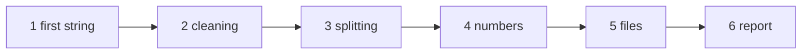

# The tutorial

The tutorial teaches StringiFor by building one program, step by step. The [cookbook](./cookbook) then collects short
recipes for everyday tasks, and the [reference](/guide/features#feature-map) has every method and every argument.

## The chapters

The tutorial builds `report`, a program that reads a small table of cars from a CSV file and prints a report: from a
first string to a file read, cleaned, computed and laid out. Each chapter is a complete program that you can compile and
run; every output shown is the real output of that program.

| Chapter | You learn |
|---|---|
| [1. A first string](./tutorial/01-first-string) | the `string` type; assignment, printing, `//` and `.cat.`, comparisons |
| [2. Cleaning and transforming](./tutorial/02-cleaning) | `strip`, `replace`, `unique`, `compact`, `squeeze`, `transliterate`, upper and lower case, word-level case styles |
| [3. Splitting and joining](./tutorial/03-splitting) | `split` (also keeping the empty fields), `join`, `partition`; `start_with`, `end_with`, `index`, `count`; a method on a whole array |
| [4. Numbers](./tutorial/04-numbers) | `is_number`, `is_integer`, `is_real`, `to_number`, `read_number`, numbers assigned to strings, `hex` |
| [5. Files and paths](./tutorial/05-files) | `read_file`, `write_file`, `basedir`, `basename`, `extension`, `match` |
| [6. A polished report](./tutorial/06-report) | `ljust`, `rjust`, `slice`, `justify`, `colorize` |



## The cookbook

[The cookbook](./cookbook) answers "how do I ...?" in a few lines each: split a line into words, read a whole file,
check whether a string is a number, compare two versions, ...

## Building the examples

Every program of the tutorial and of the cookbook is in [`docs/examples/src`](https://github.com/szaghi/StringiFor/tree/master/docs/examples/src).
With StringiFor built by FoBiS (`fobis build --mode stringifor-static-gnu`, see [Installation](/guide/installation)):

```bash
gfortran -I lib/mod docs/examples/src/report_1.f90 lib/libstringifor.a -o report
./report
```

`bash scripts/docs_examples.sh` builds and runs all of them, regenerating the outputs shown in these pages. The programs
that read a file expect the ones of [`docs/examples/files`](https://github.com/szaghi/StringiFor/tree/master/docs/examples/files)
in the current directory.
